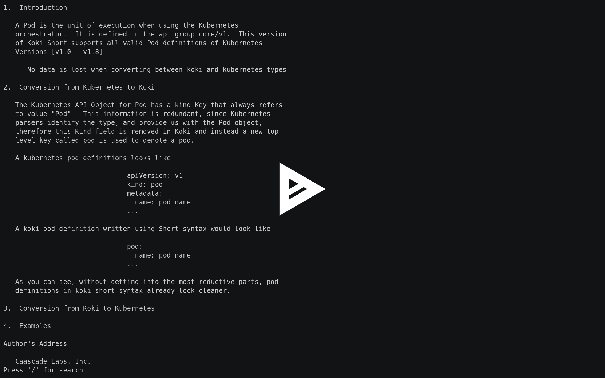

# Getting Help 

Users have a number of ways to get help with using Koki Short. 

This [docs](https://docs.koki.io/short) website is a complete, and exhaustive resource for help with using Koki. Other than this, we provide support and help for our users using the mechanisms outlined below.

## Command Line Help

Each of the commands, and sub-commands in the Short project support the help flag (`-h` or `--help`). The help flag provides information about the expected arguments and flags. This should be the first resource to turn to while looking for information about a command in the Short project. 

## Man pages

The Short project comes with its own built in man pages for complete information about resources, their transformations, and skeletons. The man page can be accessed by using the `man` subcommand. 

```sh
# Get information about pods
$$ short man pod
```
[](https://asciinema.org/a/AbjPBdIzj6rUz9k7PLLnSfaWf)

As shown in the ascii video above, the man pages are searchable. Press the `/` key to start searching within the man page. Press `Ctrl+c` to exit a man page after viewing its contents.

## YAML Skeletons

We encourage users to write Short syntax instead of native Kubernetes syntax. In order to facilitate this, we provide skeletons for every Short resource type. They are available in the man pages, as well under the [Resources](../resources/index.md#resources) section under each resource. Users can copy these and use them as a starting point for writing their spec files.

## Github Issues

If none of these above method address the issue you are facing, the creators of Short are always available to address issues faced by its users. First search [Github Issues](https://github.com/koki/short/issues) to check if your issue has already been addressed, if not [Add a Github Issue](https://github.com/koki/short/issues/new) describing your issue in detail so that the creators can help you in the best way possible.
